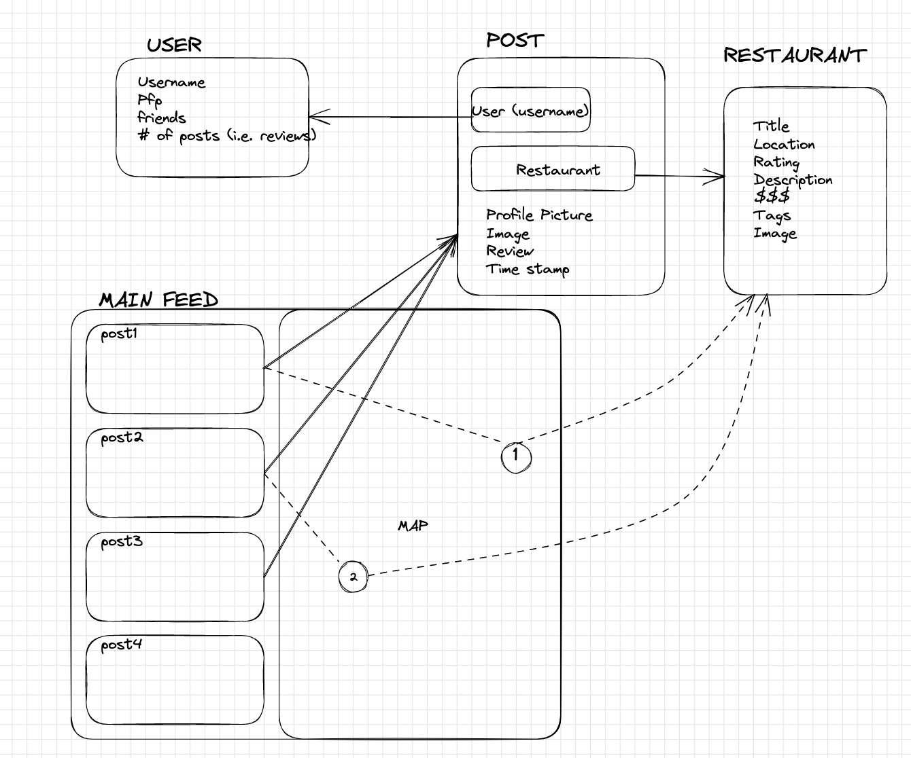

# FoodIG 

## Overview
*Yelp* and *Google Reviews* are written by strangers that you cannot necessarily trust. Our solution is to create an application which creates a more personalized food-rating experience! The application connects you to your friends and allows you to see what/where your friends are eating via posts on a feed.

The UI will be half map (showing locations of the restaurants) / cards (reviews/photos of restaurants) on each person's account.

## Goals 
### Essential Goals
1. Connect with other people also interested in trying new food by adding them as friends! You can comment on posts and chat with users(almost like a social media) Basically a [https://letterboxd.com/](https://letterboxd.com/) but for food haha
2. A map feature where you can drop “pins” for all the food places tried
3. Authentication features so that people can make accounts
4. Ability to rate/review/add photos of restaurants and make posts
5. A feed page where all of your friends posts will show up on one half of the screen, and map on the other half of the screen.

### Stretch goals:

1. Public and private posts
2. Recap of the year
3. Discover feature for public profiles
    * Filters (type, price..)
4. Suggested restaurants
5. Link other social media account/phone number

## Technical Specifications:
1. **Database:** [MongoDB Database](https://www.mongodb.com/).
2. **Backend:** Node.js & Express.js to communicate with the frontend.
3. **UI/ Frontend:** React.
4. **APIs:**
   * People can query a restaurant or a cafe to add a pin on their map using [Google Maps API](https://developers.google.com/maps/documentation/javascript/places#place_search_requests).
   * There’s also an option to look for nearby places using [this]( https://developers.google.com/maps/documentation/javascript/places#place_search_requests).
   * Authentication 

## Schema Diagram 
 

