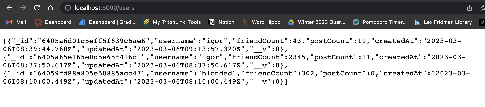
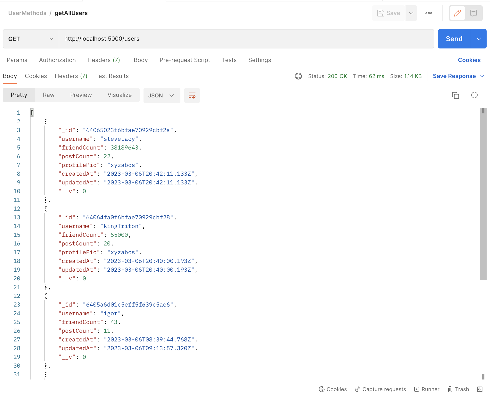
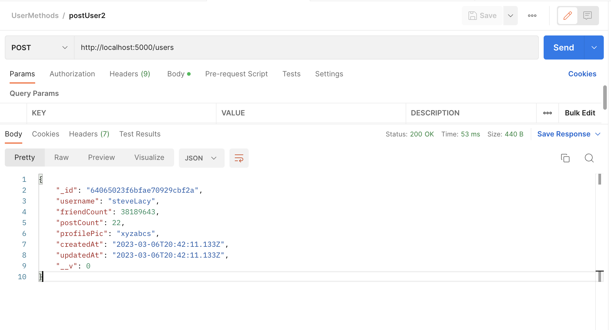
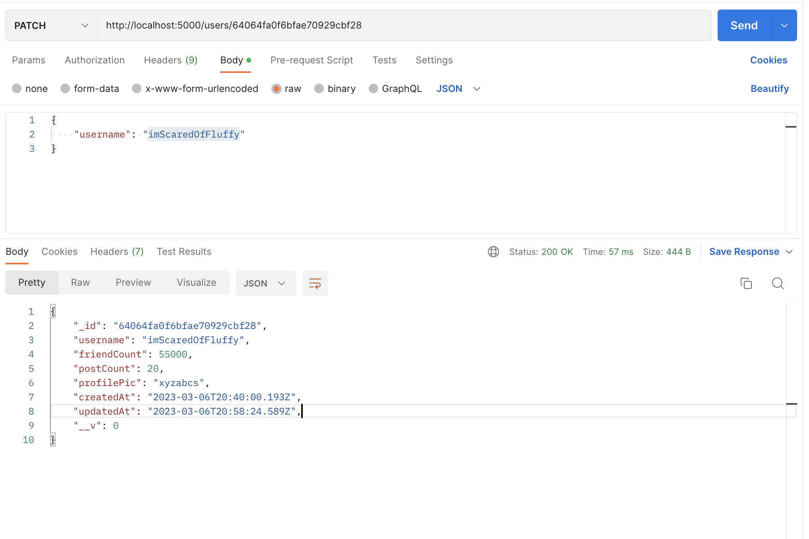
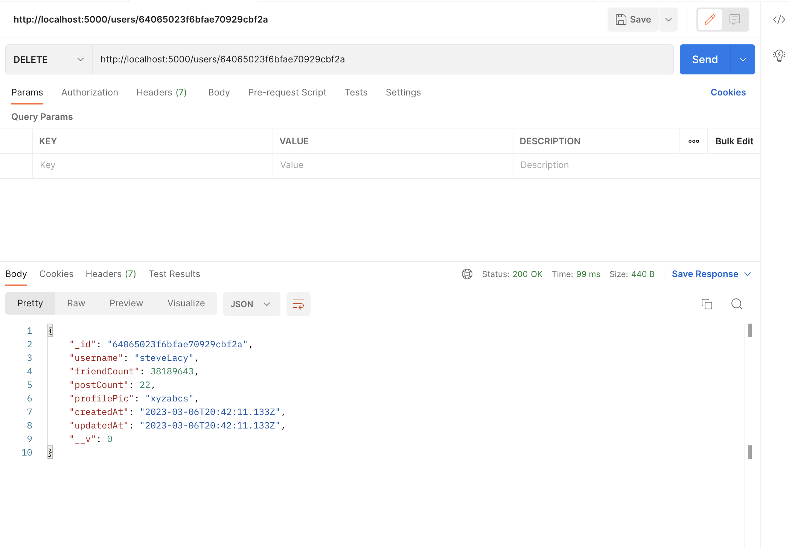
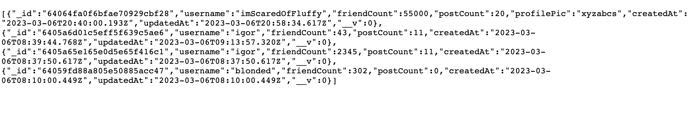
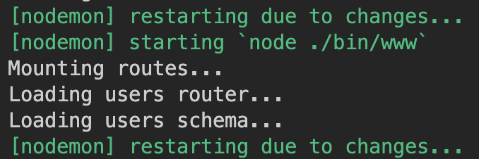
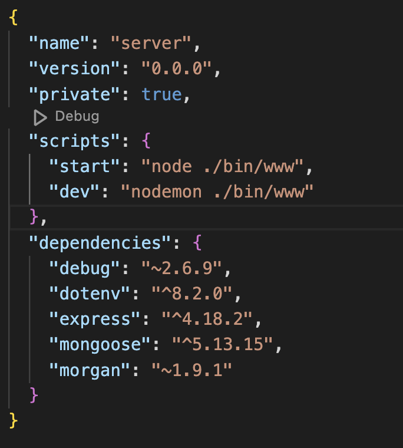

# Backend Structure
```
server
(the main backend directory)
	app.js: The main file of the backend - basically the entry point of the program
					- contains the middleware (actually using the routers) using app.use()
					- connects to the MongoDB database using mongoose.connection()
		models
		(directory that contains the user, post and restaurant schema)		
				- postModel.js
				- userModel.js
				- restaurantModel.js
		routes 
		(this directory contains js files for each type of model and basically 
		ROUTES to forward the supported requests to the appropriate controller 
		functions. )
				- users.js
				- posts.js
				- restaurants.js
		controllers 
		(directory contains .js files that return HTTP responses for GET, POST, PATCH 
		 and DELETE)
					- postsController.js 
							// todo 
					- usersController.js 
							- contains 5 functions to manipulate User objects 
							{ createUser, getUser, getUsers, deleteUser, updateUser }
					- restaurantsController.js 
							// todo 
```
---
## Example router:

```
console.log('Loading restaurants router...');

const express = require('express');

const {
    getRestaurants, 
    getRestaurant, 
    createRestaurant, 
    deleteRestaurant, 
    updateRestaurant
} = require('../controllers/usersController')


const User = require('../models/restaurantModel');

const router = express.Router();

// GET all restaurants 
router.get('/', getRestaurants); 

// GET a single restaurnt 
router.get('/:id', getRestaurant);

// POST a new restaurant 
router.post('/', createRestaurant);

// DELETES a restaurant 
router.delete('/:id', deleteRestaurant);


// UPDATES a restaurant 
router.patch('/:id', updateRestaurant);

module.exports = router;

// all of these functions such as getRestaurants, createRestaurant etc are 
// actually defined within the controllers directory. We just export them from 
// there to use here
```
**Note**: I add print statements console.log('Loading restaurants router...') so that i know which file is being run otherwise its too confusing 

---
## Example Controller:
To get all the users from the MongoDB database or to get a specific user by id, we can use the following functions defined in the `usersController.js ` file:

```
const User = require('../models/userModel');
const mongoose = require('mongoose')
// get all users 
const getUsers = async (req, res) => {
    const users = await User.find({}).sort({
        createdAt: -1
    })
    res.status(200).json(users)
}

// get singular user 
const getUser = async (req, res) => {
    const {
        id
    } = req.params
    const user = await User.findById(id)

    if (!mongoose.Types.ObjectId.isValid(id)) {
        return res.status(404).json({
            error: 'No such user'
        })
    }
    if (!user) {
        return res.status(404).json({
            error: 'No such user'
        })
    }
    res.status(200).json(user)
}
```
---
## Testing using POSTMAN

This is what you should see on http://localhost:5000/users



You will probably have a Cannot GET \ error on [http://localhost:5000](http://localhost:5000/users) and that makes sense because we are not doing anything there. 


---

Then, on postman, testing **getAllUsers**:


To test getting one user, we just need to change the URL to http://localhost:5000/users/${id} where id is the “_id” field of the User object. 

---

Next, testing **postUser1**

- Set the request method to POST
- Go to body > raw > JSON (from the dropdown)
- Specify the “User” object you want to post
- Hit send
- Check the db to see if its actually there



---

Next, we will test **PatchUser1** 

- Here, in the body of the JSON, we will only put what we need to update on the object. So, I changed the username from “kingTriton” to “imScaredOfFluffy”.
- The id in the request URL belongs to the object you want to update.
- The only fields that get updated are the ones included in the JSON that is sent with the request!



---

Now, we will test **deleteUser2**

remember how we made that one config directory? that was basically breaking everything lol 

so when i deleted it everything worked 

so deleting everything works sometimes

how did u fix ur laptop then? was it the config that was breaking it?



This deletes SteveLacy from the db. If we reload, http://localhost:5000/users , we will see that steveLacy is gone 😢



--- 

## Using Nodemon

If you don’t wanna restart the server each time you make a change, you can install nodemon which  restarts the server like this automatically:



Run the following commands in the terminal:

```jsx
$ cd server 
$ npm install -g nodemon 
$ nodemon app.js
```

Optionally, you can also add a dev script in your package.json file like this:



Then, you can run 

```jsx
npm run dev 
```

which essentially runs the “dev” script and starts nodemon. To exit out of nodemon, hit control + C. 


---

## Todo List:

- [x]  Add some fields to the User {charvi}
- [x]  Add restaurant model + router + controller {charvi}
- [x]  Add post model + router + controller {charvi}
    Refer to schemas here:
- [ ]  Maps routes
- [ ]  Auth routes {json}
- [x]  Clean up branches {alexis}
- [x]  Clean up DB {alexis}
- [ ]  Figure out how to use multer for image upload for posts and restaurants {charvi}
- [ ]  Ask frontend if they need any other specific methods


